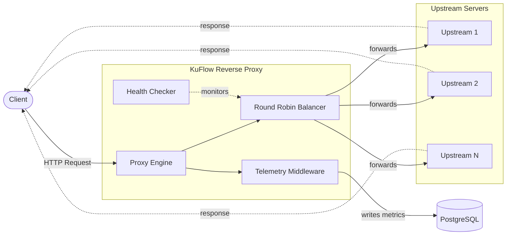

<div align="center">

# ⚡ KuFlow

**High-performance Reverse Proxy and HTTP Telemetry Platform written in Go**

[](https://go.dev)
[](https://www.postgresql.org)
[](https://www.docker.com)
[](LICENSE)
[](#current-status)

[Overview](#overview) •
[Features](#features) •
[Tech Stack](#technology-stack) •
[Structure](#project-structure) •
[Status](#current-status) •
[Authors](#authors)

</div>

---

## Overview

**KuFlow** is an educational open-source project developed by two Computer Engineering students.

The goal of the project is to build a **production-like reverse proxy** while learning real backend and infrastructure engineering practices, including:

| | | |
|---|---|---|
| 🔧 Backend Development | 🌐 Networking | 🔀 Reverse Proxy Architecture |
| ⚖️ Load Balancing | 🏗️ System Design | 🐘 PostgreSQL |
| 📦 Database Migrations | 🐳 Docker | 🐹 Go |

Unlike a simple reverse proxy, KuFlow is designed to become a **complete HTTP traffic collection and analysis platform**.

---

## Features

- 🔀 **Reverse HTTP Proxy** — routes incoming traffic to backend services
- 🖥️ **Multiple Upstream Servers** — distributes load across several targets
- ⚖️ **Round Robin Load Balancing** — even traffic distribution out of the box
- ❤️ **Automatic Health Checker** — detects and excludes unhealthy upstreams
- 📊 **HTTP Telemetry Collection** — captures request/response metadata
- 🐘 **PostgreSQL Telemetry Storage** — persistent, queryable traffic history
- 📦 **Versioned Database Migrations** — reproducible schema evolution
- 🐳 **Dockerized Infrastructure** — one command to spin up the whole stack
- 🧱 **Clean Project Architecture** — clear separation of concerns

---

## Technology Stack

| Layer            | Technology               |
|-------------------|---------------------------|
| Language          | Go                        |
| HTTP              | `net/http`                |
| Reverse Proxy     | `httputil.ReverseProxy`   |
| Database          | PostgreSQL                |
| Migrations        | `golang-migrate`          |
| Containers        | Docker                    |
| Version Control   | Git                       |
| IDE               | VS Code                   |
| OS                | Ubuntu (WSL)              |

---

## Quick Start

Requirements: [Docker](https://docs.docker.com/get-docker/) and [Docker Compose](https://docs.docker.com/compose/install/).

```bash
# 1. Clone the repository
git clone https://github.com/Rowlyge/kuflow.git
cd kuflow

# 2. Copy the example environment file and adjust values if needed
cp .env.example .env

# 3. Start the full stack (proxy + upstreams + PostgreSQL)
docker-compose up -d

# 4. Check that services are running
docker-compose ps
```

By default the proxy listens on `http://localhost:8080` and forwards requests to the configured upstream servers, while telemetry is written to PostgreSQL.

To stop and remove the stack:

```bash
docker-compose down
```

---

## Project Structure

```text
kuflow/
│
├── cmd/
│   ├── kuflow/              # Main application entrypoint
│   └── upstream/            # Test upstream server(s)
│
├── docs/
│   ├── architecture.md      # System design & data flow
│   ├── database.md          # Schema & migrations reference
│   └── roadmap.md           # Planned milestones
│
├── internal/
│   ├── app/                 # Application wiring & bootstrap
│   ├── balancer/            # Load balancing strategies
│   ├── clientip/            # Client IP resolution
│   ├── config/              # Configuration loading
│   ├── database/            # DB connection & setup
│   ├── handlers/            # HTTP handlers
│   ├── health/              # Health checking logic
│   ├── middleware/          # HTTP middleware chain
│   ├── model/                # Domain models
│   ├── proxy/                # Reverse proxy core
│   ├── repository/           # Data access layer
│   ├── service/              # Business logic
│   └── upstream/             # Upstream management
│
├── migrations/                # SQL migration files
│
├── docker-compose.yml
├── Makefile
├── .env.example
├── .gitignore
├── LICENSE
└── README.md
```

---

## Architecture



**Request flow:**

1. Client sends an HTTP request to KuFlow.
2. The **Proxy Engine** receives it and passes it to the **Balancer**.
3. The **Balancer** selects a healthy upstream using round-robin, informed by the **Health Checker**.
4. The request is forwarded to the chosen **Upstream Server**, and its response is returned to the client.
5. In parallel, the **Telemetry Middleware** records request/response metadata and persists it to **PostgreSQL** for later analysis.

---

## Implemented Components

- ✅ Proxy Engine
- ✅ Upstream Manager
- ✅ Round Robin Balancer
- ✅ Automatic Health Checker
- ✅ Reverse Proxy Middleware
- ✅ HTTP Telemetry Middleware
- ✅ PostgreSQL Repository
- ✅ Versioned Database Migrations

---

## Development Principles

> The rules we try to follow while building KuFlow.

- 🧩 Keep architecture simple
- 🔗 Prefer composition over complexity
- 📖 Write readable and maintainable code
- 🧱 Keep business logic independent from infrastructure
- 📦 Use version-controlled database migrations
- 🏭 Build production-like components instead of educational shortcuts

---

## Current Status

**Currently implemented:**

- Reverse Proxy Engine
- Multiple Upstream Support
- Round Robin Load Balancer
- Automatic Health Checker
- HTTP Telemetry Collection
- PostgreSQL Persistence
- Database Migrations using `golang-migrate`

**Next milestones:**

- [ ] Configurable Load Balancing Algorithms
- [ ] Graceful Shutdown
- [ ] Advanced Telemetry
- [ ] Analytics Pipeline

---

## Authors

<table>
  <tr>
    <td align="center">
      <b>Michail Sokun</b>
    </td>
    <td align="center">
      <b>Georgiy Kuzin</b>
    </td>
  </tr>
</table>

---

## License

This project is licensed under the terms of the [MIT License](LICENSE).