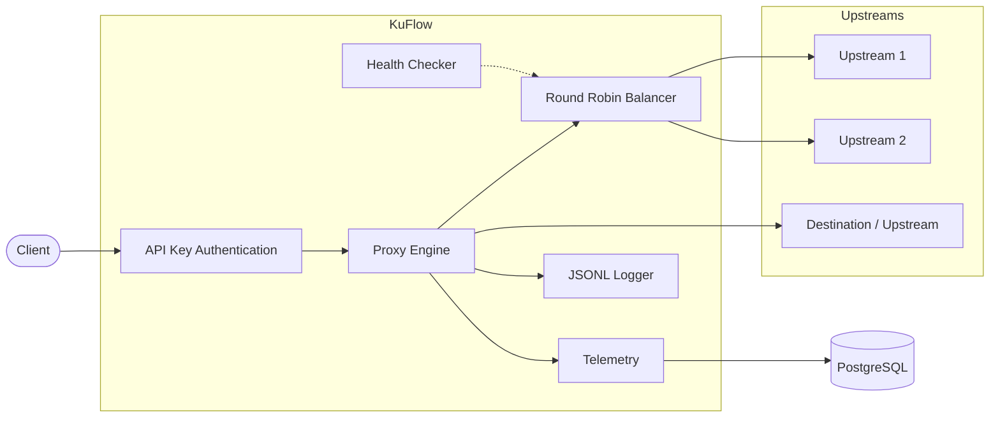

<div align="center">

# ⚡ KuFlow

**High-performance Reverse Proxy, Forward Proxy and HTTP Telemetry Platform written in Go**

[](https://go.dev)
[](https://www.postgresql.org)
[](https://www.docker.com)
[](LICENSE)
[](#current-status)

[Overview](#overview) •
[Features](#features) •
[Tech Stack](#technology-stack) •
[Structure](#project-structure) •
[Status](#current-status) •
[Authors](#authors)

</div>

---

## Overview

**KuFlow** is an educational open-source project developed by two Computer Engineering students.

The goal of the project is to build a **production-like reverse proxy** while learning real backend and infrastructure engineering practices, including:

|                        |                   |                               |
| ---------------------- | ----------------- | ----------------------------- |
| 🔧 Backend Development | 🌐 Networking     | 🔀 Reverse Proxy Architecture |
| ⚖️ Load Balancing      | 🏗️ System Design | 🐘 PostgreSQL                 |
| 📦 Database Migrations | 🐳 Docker         | 🐹 Go                         |

Unlike a simple reverse proxy, KuFlow is designed to become a **complete HTTP traffic collection and analysis platform**.

KuFlow currently supports both **Reverse Proxy** and **Forward HTTP/HTTPS Proxy** modes, including HTTPS tunneling via the CONNECT method. The project also includes API Key authentication, runtime health monitoring, structured connection logging, and telemetry collection designed for future analytics pipelines.

---

## Features

* 🔀 **Reverse HTTP Proxy** — routes incoming traffic to backend services
* 🌍 **Forward HTTP Proxy** — supports standard HTTP proxy mode
* 🔒 **HTTPS CONNECT Tunneling** — full TCP tunneling for HTTPS traffic
* 🖥️ **Multiple Upstream Servers** — distributes load across several targets
* ⚖️ **Round Robin Load Balancing** — even traffic distribution out of the box
* ❤️ **Automatic Health Checker** — detects and excludes unhealthy upstreams
* 🔑 **API Key Authentication** — protects proxy access using PostgreSQL-backed API keys
* 📊 **HTTP Telemetry Collection** — captures request/response metadata
* 📄 **Structured JSONL Logging** — connection events ready for analytics pipelines
* 📈 **Traffic Counters** — upload/download statistics for CONNECT sessions
* ⏱️ **Idle Timeout Protection** — automatically closes inactive tunnels
* 🐘 **PostgreSQL Telemetry Storage** — persistent, queryable traffic history
* 📦 **Versioned Database Migrations** — reproducible schema evolution
* 🐳 **Dockerized Infrastructure** — one command to spin up the whole stack
* 🔁 **Nginx Reverse Proxy Support** — production deployment through Nginx
* ⚙️ **systemd Service** — automatic startup on Linux servers
* 🧱 **Clean Project Architecture** — clear separation of concerns

---

## Technology Stack

| Layer                | Technology              |
| -------------------- | ----------------------- |
| Language             | Go                      |
| HTTP                 | `net/http`              |
| Reverse Proxy        | `httputil.ReverseProxy` |
| Forward Proxy        | Custom HTTP Proxy       |
| HTTPS Tunnel         | CONNECT                 |
| Authentication       | API Keys                |
| Database             | PostgreSQL              |
| Migrations           | `golang-migrate`        |
| Containers           | Docker                  |
| Reverse Proxy Server | Nginx                   |
| Service Manager      | systemd                 |
| Version Control      | Git                     |
| IDE                  | VS Code                 |
| OS                   | Ubuntu (WSL/Linux)      |

---

## Quick Start

Requirements: Docker and Docker Compose.

```bash
# 1. Clone the repository
git clone https://github.com/Rowlyge/kuflow.git
cd kuflow

# 2. Copy environment variables
cp .env.example .env

# 3. Start infrastructure
docker-compose up -d

# 4. Verify services
docker-compose ps
```

By default the proxy listens on `http://localhost:8080`.

For production deployments KuFlow is typically placed behind **Nginx**, exposing the proxy on **80/443**, while the Go application continues listening on the internal port `8080`.

Stop everything:

```bash
docker-compose down
```

---

## Project Structure

```text
kuflow/
│
├── cmd/
│   ├── kuflow/
│   └── upstream/
│
├── docs/
│   ├── architecture.md
│   ├── database.md
│   └── roadmap.md
│
├── internal/
│   ├── app/
│   ├── auth/
│   ├── balancer/
│   ├── clientip/
│   ├── config/
│   ├── database/
│   ├── handlers/
│   ├── health/
│   ├── middleware/
│   ├── model/
│   ├── proxy/
│   ├── repository/
│   │   └── apikey/
│   ├── requestid/
│   ├── service/
│   │   └── auth/
│   ├── telemetry/
│   └── upstream/
│
├── migrations/
├── docker-compose.yml
├── Makefile
├── .env.example
├── .gitignore
├── LICENSE
└── README.md
```

---

## Architecture



**Request flow:**

1. Client connects to KuFlow.
2. API Key authentication validates access.
3. KuFlow determines whether the request should be processed as:

   * Reverse Proxy
   * Forward HTTP Proxy
   * HTTPS CONNECT Tunnel
4. Reverse Proxy requests are balanced across healthy upstream servers.
5. Forward Proxy requests are forwarded directly to the requested destination.
6. CONNECT requests establish a bidirectional TCP tunnel.
7. Traffic statistics and structured logs are generated during request processing.
8. Telemetry is persisted into PostgreSQL.

---

## Implemented Components

* ✅ Reverse Proxy Engine
* ✅ Forward HTTP Proxy
* ✅ HTTPS CONNECT Tunnel
* ✅ Proxy Engine
* ✅ Upstream Manager
* ✅ Round Robin Balancer
* ✅ Automatic Health Checker
* ✅ API Key Authentication
* ✅ PostgreSQL API Key Repository
* ✅ HTTP Telemetry Middleware
* ✅ Structured JSONL Connection Logging
* ✅ CONNECT Traffic Counters
* ✅ Idle Timeout Protection
* ✅ PostgreSQL Repository
* ✅ Versioned Database Migrations
* ✅ systemd Deployment
* ✅ Nginx Reverse Proxy Configuration

---

## Development Principles

> The rules we try to follow while building KuFlow.

* 🧩 Keep architecture simple
* 🔗 Prefer composition over complexity
* 📖 Write readable and maintainable code
* 🧱 Keep business logic independent from infrastructure
* 📦 Use version-controlled database migrations
* 🏭 Build production-like components instead of educational shortcuts

---

## Current Status

**Currently implemented:**

* Reverse Proxy
* Forward HTTP Proxy
* HTTPS CONNECT Tunnel
* Multiple Upstream Support
* Round Robin Load Balancer
* Automatic Health Checker
* API Key Authentication
* PostgreSQL-backed API Key Repository
* HTTP Telemetry Collection
* Structured JSONL Logging
* CONNECT Traffic Accounting
* Idle Timeout Handling
* PostgreSQL Persistence
* Database Migrations
* Nginx Deployment
* systemd Service

**Next milestones:**

* [ ] Runtime API Key Cache
* [ ] Runtime API Key Management API
* [ ] Rate Limiting
* [ ] Graceful Shutdown
* [ ] WebSocket Proxy Support
* [ ] HTTP/2 Support
* [ ] Advanced Telemetry
* [ ] Analytics Pipeline

---

## Authors

<table>
  <tr>
    <td align="center">
      <b>Michail Sokun</b>
    </td>
    <td align="center">
      <b>Georgiy Kuzin</b>
    </td>
  </tr>
</table>

---

## License

This project is licensed under the terms of the [MIT License](LICENSE).
